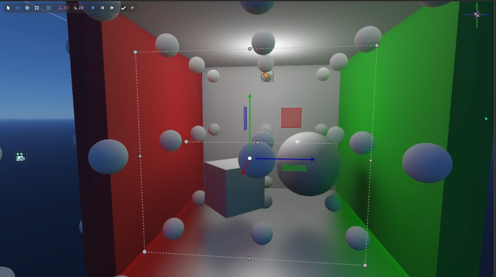
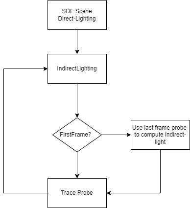
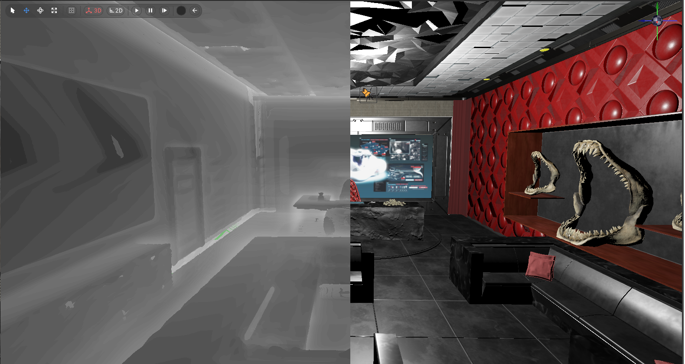
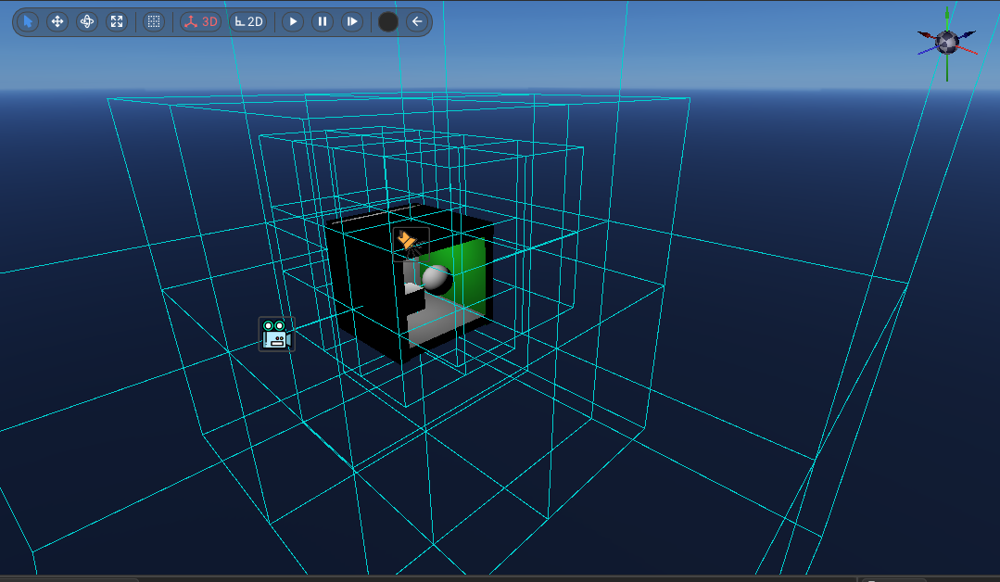
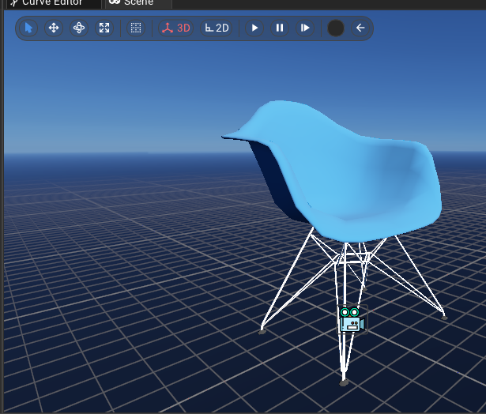
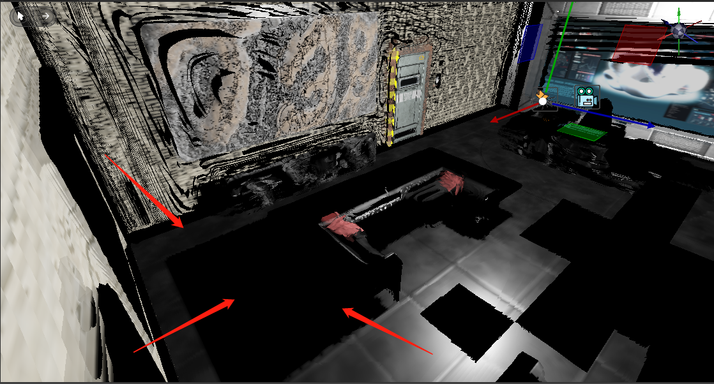
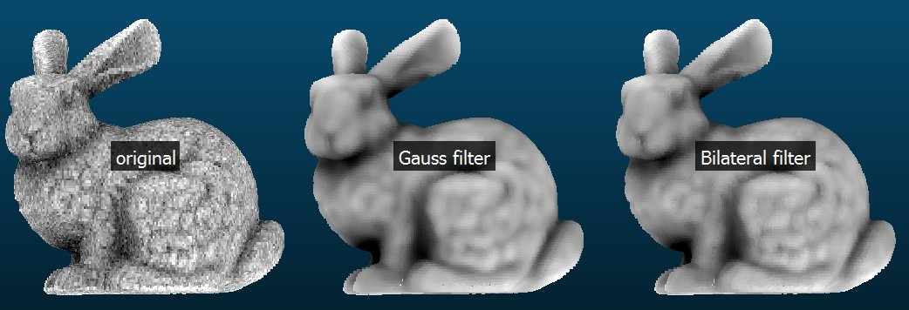
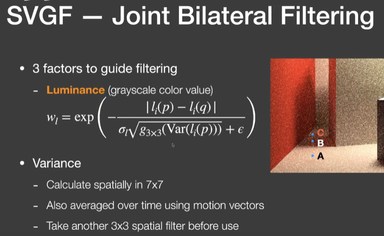

# Lux-GI

Hybrid GI solution, based on DDGI ( include  Ray-Tracing and SDF-Tracing )

Code and Document is working in progress



## Showcase

[bilibili](https://www.bilibili.com/video/BV1NM411y7sv/)

[youtuebe](https://www.youtube.com/watch?v=RfRbWnsdwx0)

## Document

[English-Version](./English.md)

[中文版](./Chinese.md)


# 介绍

该项目为一套Hybrid GI 方案，其中部分灵感来自于Lumen和DDGI. 主要的核心出发点为，提供一套完整的GI方案（包含Indirect-Light, Infinite-Bounce, Emissive-Lighting, Glossy-Reflection, Shadow, AO)，能同时运行在Raytracing支持和没有光线追踪的硬件上. 由于时间仓促，本项目还存在部分性能问题，但是作为抛砖引玉，相信能给大部分对GI感兴趣的朋友提供一些新的思路。

在正式开始之前，我们先聊聊DDGI（Dynamic-Diffuse-Global-Illumination)
## DDGI

在DDGI( [描述](https://morgan3d.github.io/articles/2019-04-01-ddgi/), [论文](https://jcgt.org/published/0008/02/01/) )的原始实现当中，DDGI是一种实时的基于探针和光线追踪的技术，主要解决的动态场景和光源的全局光照漫反射的项。

传统的光照探针(Probe)的作用在于从探针的角度去收集光照信息，当对屏幕某个着色点进行着色的时候，获取该着色点相近的Probe，然后进行插值计算。因此通过插值计算可以把每个探针获取的离散信息还原成连续的光照信息，但是一旦出现信号突变的情况，可以会存在漏光问题。

但是在DDGI中，每个探针通过保存场景的几何信息，然后通过概率的方式，可以极大程度的避免漏光。

### 1.DDGI Probe

DDGI Probe 使用了一个八面体映射（Octahedral Map）的方法存储球面信息. 通过八面体映射的方式能够很好的将其压缩到一个Texture2D当中。
. （如果熟悉lumen的朋友，lumen也同样使用了这种方式表达探针)


### 2.DDGI 基本流程

Step1. 对于每一个Probe生成100-300光线，并且进行追踪，获取到当前光线打到的颜色和距离信息。因此需要创建Texture2D记录当前的信息。
```c++
    //Radiance for every ray.
    internal.radiance->setName("DDGI Raytrace Radiance");
    internal.radiance->buildTexture(TextureFormat::R11G11B10F, pipeline.raysPerProbe, totalProbes);

    //Direction and Depth for every ray.
    internal.directionDepth->setName("DDGI Raytrace Direction Depth");
    internal.directionDepth->buildTexture(TextureFormat::RGBA16, pipeline.raysPerProbe, totalProbes);
```
因为光线击中的点的漫反射 GI 是由前一帧的Probe提供，因此可以通过这种方式实现无限回弹。


纵轴为ProbeId，横轴为每次射线所获取的Radiance

Step2. 当获取到Radiance和Depth之后，更新探针，即使用Radiance贴图来更新Probe的Irradiance（同时更新距离信息）. 

```c++
    for(int32_t i = 0;i<2;i++)
    {
        internal.depth[i]->setName("DDGI Depth Probe Grid " + std::to_string(i));
        internal.depth[i]->buildTexture(TextureFormat::RG16F, depthWidth, depthHeight);    //Depth and Depth^2

        internal.irradiance[i]->setName("DDGI Irradiance Probe Grid " + std::to_string(i));
        internal.irradiance[i]->buildTexture(TextureFormat::RGBA16, irradianceWidth, irradianceHeight);
    }
```

Step3. 边界进行更新

因为DDGI使用了双线性插值，因此对于边界需要进行特殊的操作。如图所示：


Step4. 对每一帧每一个像素使用其邻近的8个探针进行采样。
值得注意项， 在使用探针进行采样的时候，我们需要进行可见性测试，以防止漏光的问题。

- 可见性测试：
由于存在Probe和采样点之间有墙的问题，因此我们需要进行可见性测试去避免漏光。


在上文中，我们知道在每次进行光线追踪的时候，存储的当前光线所击中的距离信息 $d$ 以及距离的平方 $d^2$，因此我们可以使用 $d$ 和 $d^2$ 进行可见性测试

在此处我们引入切比雪夫不等式：

$P(r > d) \leq \frac{Var}{Var + (d - mean) ^ 2}$

其中 $r$ 是Probe往着色点方向看到最近物体的距离, $d$ 为着色点和Probe之间的距离， $P(r > d)$ 代表没有遮挡物的概率。

当 $d > mean$时, 我们使用切比雪夫权重，否则直接使用1

### 无限Bounce

反复使用前一帧Probe的数据进行对当前场景进行一次间接光照，计算从而实现无限次bounce。



## SDF加速结构

SDF可以说是下一代引擎的标配,他不仅仅能提供类似于光线追踪的算法,同样还支持SDF软阴影,SDFAO 以及GPU-Particle碰撞检测等.


在DDGI的Probe进行Trace的阶段，我们需要记录每条光线所打到的距离以及颜色信息，在支持光线追踪的硬件上可以很好的实现该算法，但是由于大部分机器不支持硬件光线追踪，因此我们需要通过其他的方式来
获取颜色信息。

首先SDF是一个非常的好的加速结构，可以在很大程度上替代硬件光追，因此在本算法的实现中，对于不支持硬件光追的机器，我们采用SDF进行替代。

SDF流程：

### 生成MeshDistanceField

对于场景的中的每一个物体生成其对应的SDF，即创建32-128(按需选择)分辨率的Texture3D（R16F) 存储距离信息。并同时生成mipmap。
因为SDF的生成的过程使用的是光线追踪的方法，因此我们可以使用Uniform Grid , KD-Tree , BVH-Tree进行加速构建。在本项目当中使用了BHV-Tree进行加速求交。

同时对于每个物体进行一个padding操作，防止出现物体太薄导致泄漏的问题。


- Step2. 创建GlobalDistanceField

在拥有上述MeshDistanceField之后，创建GlobalDistanceField并且生成其对应的Mimmap，由于在当前算法中没有使用类似Lumen的Detail-Trace（可能在未来的版本中实现，不过GlobalSDF可以更好的配合DDGI). 创建Global用于加速SDF-Trace. 



### GlobalDistanceField的生成算法

```c++

float minDistance = DistanceMax;

minDistance *= imageLoad(uGlobalSDF,voxelCoord).r;

for (uint i = 0; i < pushConsts.objectsCount; i++)
{
    uint objId = pushConsts.objects[i];
    MeshDistanceField meshDF = data[objId];
    minDistance = min(minDistance, distanceToMeshSDF(minDistance, meshDF, uMeshSDF[objId], voxelWorldPos));
}
```
在游戏中需要满足实时性,因此当场景中的部分元素发生变化时,我们需要对GlobalSDF进行更新操作. 因此对于需要对空间进行划分,即更新动态物体所在的网格，在本算法中我们使用Uniform Grid即Chunk的方式.



特别注意点在于，Mimmap的生成需要手动计算，因为当前缩小之后的值不是周围点求加全平均，而是要取最小值，类似于Hi-Z的生成方式。

### SDF Surface Material生成

当我们有了SDF加速结构之后,我们就可以使用SDF进行追踪, 但是SDF本质上是一个描述距离的函数, 不提供任何的颜色以及材质信息, 因此我们需要构建额外的数据类型来生成SDF对应点的颜色以及材质信息.

Lumen 实现的[Surface Cache](https://docs.unrealengine.com/5.0/en-US/lumen-technical-details-in-unreal-engine/)是一种非常高效的获取SDF材质的方法, 在当前的算法中使用了同样的方式进行SDF材质表达.

#### Surface-GBuffer

对场景中的每一个物体进行6面捕捉,并且分别渲染到不同的SurfaceAtlas上. 这个过程和传统的GBuffer流程一样。
在当前的算法中，我们分别生成了Color/Normal/Depth/PBR/Emissive/LightCache Atlas. 以及每一个面所生成的TileBuffer



#### 剔除

为了提高整体的渲染效率和避免重复绘制，在这个阶段我们需要对场景中的对象（包括每个对象所关联的Tile）进行剔除操作。

#### 灯光剔除

灯光剔除阶段，对于点光源和聚光灯，保留所有在其范围内的对象；对于平行光强，保留所有可能受影响的对象（按需）。

#### 对象剔除

剔除掉摄像机Far-Plane之外的物体，同时忽略掉体积小于阈值的对象. 由于世界空间被划分为不同的Chunk，为了保证SDF求交之后的性能，在此处进行一次剔除操作，即每个Chunk保留与当前Chunk相交的对象，并设置数量上限。

#### 材质获取

对SDF空间中的某个点获取材质可以进行如下操作：

1. 获得求交之后的世界坐标，并把当前的世界坐标转化到对应的ChunkId上。

2. 遍历当前Chunk中所有的Tile，根据击中点的法线方向和面的朝向进行判断，如果当前的光线几乎平行于表面，则丢弃掉。

3. 如果不平行于当前面，则尝试进行采样。因为SDF求交之后存在精度问题，因此采样时，我们获取到当前击中点的周围的4个点进行一次双线性插值来保证采样的正确性。

### 光照

#### 直接光照

之后更新所有受影响对象的Tile数据(SDF场景表达不需要实时性，因此可以进行分帧操作)，使用当前的SDF-GBuffer进行一次直接光照并存入SurfaceLightCache。 因为SDF提供可见性查询，因此在SurfaceDirectLight阶段可以直接使用SDF查询阴影，如图所示：




#### 无限bounce

无限次Bounce为DDGI的原始功能，在此处值得注意的一个点为，开启无限次Bounce之后，每次的间接光照结果都要回写到SDFScene上, 直到收敛。


## 光线追踪

在硬件支持的情况下，可以开启光线追踪替代SDF-Trace， 其他实现算法差别不大，在本部分不做过多赘述。

## 反射

物体表面的反射在光线追踪和SDF-Trace的实现基本相似，主要处理Glossy Reflection和Specular Reflection
在当前的算法实现中，当物体的表面粗糙度小于0.05时，我们可以认定表面为镜面，这使用镜面光照算法


当物体表面的材质在0.05 到 0.7之间，我们认为此时的物体材质为Glossy，因为Glossy材质会产生不同方向的反射光线，为了保证采样在空间上的均匀性，我们使用[蓝噪声和Sobol序列](https://belcour.github.io/blog/slides/2019-sampling-bluenoise/index.html)产生样本，同时使用重要性采样保证其快速收敛([参考资料](https://learnopengl.com/PBR/IBL/Specular-IBL))

当材质粗糙度大于0.7, 我们直接使用探针对当前的表面进行采样。

值得注意的点为：SDF无法进行镜面光照(因为场景为SDF表达)，为了弥补镜面光照短板，可以在SDF反射当中追加屏幕空间反射（未实现） [Lumen实现](https://docs.unrealengine.com/5.0/en-US/lumen-global-illumination-and-reflections-in-unreal-engine/)

SDF反射

光追反射


## 软阴影

SDF可以的支持软阴影效果，但是由于GlobalSDF的精度问题，目前不建议使用GlobalSDF进行可见性计算。

但是提供一种基于[光线追踪方法的软阴影](https://blog.demofox.org/2020/05/16/using-blue-noise-for-raytraced-soft-shadows/)实现方式（成本较高）


在当前的算法中，对于软阴影的采样次数1，因此场景中会有大量的噪声，在项目中使用了SVGF的方式进行降噪处理(同反射)，本方法会在下一个篇章进行一些简单阐述。

## 降噪

目前对于实时光线追踪的算法基本上都是基于一次采样+降噪的方式，在本算法中，降噪器主要应用在Glossy反射和软阴影上。


### 高斯滤波 Gaussian Filtering

高斯滤波是一种低通滤波器（其核心为求滤波核中的平均值），滤波完成之后的结果即为低频信息，因此过滤出来的结果会出现整个画面模糊的情况。但是对于游戏的一些画面来说，低通滤波是不完美的。[参考文献](http://rastergrid.com/blog/2010/09/efficient-gaussian-blur-with-linear-sampling/)

### 双边滤波 Bilateral Filtering

由于高斯滤波是一种低通滤波器，对于信号变化比较大的图像则无法很好的保持其边界。因此我们可以使用双边滤波的方式对图像进行处理。双边滤波中，一个重要的参考值为当前的像素的亮度的变化量作为权值，即亮度变化大权重则小。[参考文献](https://en.wikipedia.org/wiki/Bilateral_filter)




### 联合双边滤波 Joint Bilateral Filtering

在高斯滤波中，我们考虑了像素之间的距离作为贡献权重, 双边滤波当中考虑了像素的亮度。在实时渲染当中我们可以使用GBuffer指导滤波，如果考虑的更多的因素（例如深度，法线features等）我们称之为联合双边滤波。

### SVGF

Spatiotemporal Variance-Guided Filtering
[NVIDA-Link](https://research.nvidia.com/publication/2017-07_spatiotemporal-variance-guided-filtering-real-time-reconstruction-path-traced) 
[知乎](https://zhuanlan.zhihu.com/p/28288053)

在当前GI的算法中我们选择了SVGF进行降噪处理，SVGF是一个运行在Spatial和Temporal的降噪算法，使用联合双边滤波，同时加入了方差分析和其他一些特性。

在SVGF中我们使用了一个[Atrous](https://jo.dreggn.org/home/2010_atrous.pdf)进行滤波操作。

#### Spatial滤波

在空间过滤部分，SVGF使用了À-Trous wavelet filter，同时使用了渐进式的增大Filter的大小降低计算资源的开销，如图所示：


```c++
for (int yy = -RADIUS; yy <= RADIUS; yy++)
{
    for (int xx = -RADIUS; xx <= RADIUS; xx++)
    {
        const ivec2 coord = coord + ivec2(xx, yy) * STEP_SIZE; 
        // Edge stop....
    }
}
```

##### 深度处理


在Atrous中，我们首先考虑深度因素，如图A/B, 因为AB在同一个面上，因此在过滤的过程中，AB应该相互贡献，但是AB的深度有差异，因此对于深度的处理，我们会更加偏向于使用深度的梯度进行操作。

##### 法线处理

其次我们考虑法线对降噪的影响


如图所示，如果AB两点的夹角越小，说明两个点的方向可能存在一直性，因此$ W_n $的值更加趋近与1

##### 颜色处理



颜色对于权重的贡献主要体现在颜色亮度的变化即Luminance，但是由于噪声的存在，可能获取的到的某个点的原色不是很准确，因此我们可以通过方差来修正这个问题。

#### Temporal滤波

在时间上的滤波主要是复用上一帧的信息，在这种情况下我们可以认为增加了当前像素的采样次数。

为了合理的获取上一帧像素的信息，我们使用的Motion Vector的方法记录了摄像机移动的方向，因此在当前帧中，可以通过Motion Vector映射回上一帧的具体像素。

##### 法线处理

主要检查当两个点的夹角是否小于特定的阈值，法线的判断可以使用如下公式

$Fn = |dot(n(a),n(b))| - T $(T为阈值)

如果当前的Fn大于0，则说明两个点不在一个平面上，丢弃当前的点。

##### MeshID

因为在这个阶段我们可以使用GBuffer的信息，因此可以获取到对应点的MeshID信息，如果A/B两点的MeshID不一致，则丢弃该点。


## 环境光遮蔽（TODO..）
